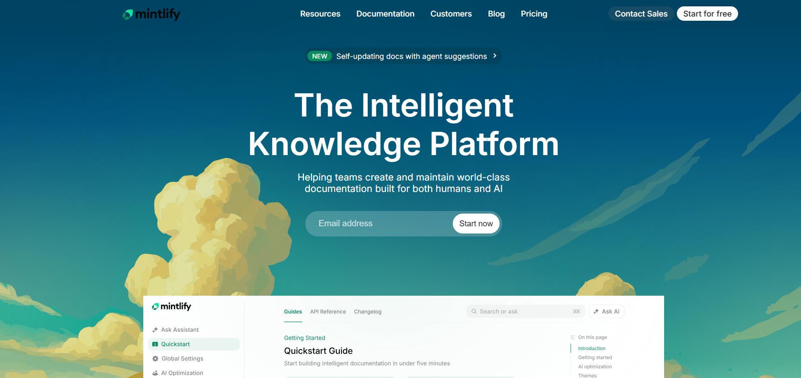

# Mintlify UI Clone

This project is a **UI recreation of the Mintlify landing and documentation interface**, built using **HTML and CSS only**.  
The goal is to replicate Mintlify’s clean, modern, and documentation-focused design while practicing layout, typography, and visual hierarchy.


---


---
🔗 Live Demo: https://unpredictable-arcane.github.io/Documentation-Website---Mintlify-CC_cohort/

---

##  Recreated Sections

The following sections of the Mintlify UI have been recreated:

- Header / Navigation Bar  
- Hero Section  
- Announcement Badge  
- Call-to-Action Area (Email input + button)  
- Documentation Layout (Sidebar + Content Area)  
- Footer Layout  

Special focus was given to spacing, gradients, and component alignment to closely match the original Mintlify UI.

---

## 🎨 Fonts and Colors Used

### Font
- **Inter**
  - Imported from Google Fonts
  - Used for headings, body text, and UI elements to match Mintlify’s typography

```css
font-family: 'Inter', sans-serif;
```
---
| Purpose             | Color Code |
|---------------------|------------|
| Background Gradient | #063a52 → #1f7a7a |
| Primary Text        | #ffffff    |
| Secondary Text      | #cbd5e1    |
| Muted Text          | #94a3b8    |
| Accent Color        | #22c55e    |
| Input Background    | rgba(255,255,255,0.1) |
| Border / Divider    | #e5e7eb    |
---
- HTML5  
- CSS3  
